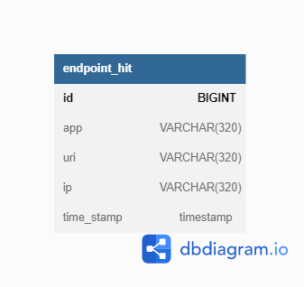
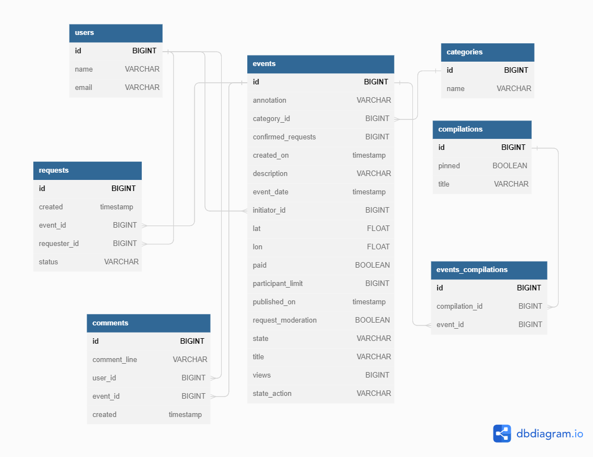

# java-explore-with-me

### Ссылка на пул-реквест: https://github.com/Uzbagoissa/java-explore-with-me/pull/3

# StatsService

## Таблица ENDPOINT_HIT:

1. id - PRIMARY KEY AUTO INCREMENT
2. app
3. uri
4. ip
5. time_stamp

# EwmService + Feature_Comments

## Таблица USERS

1. id - PRIMARY KEY AUTO INCREMENT
2. name
3. email

## Таблица CATEGORIES

1. id - PRIMARY KEY AUTO INCREMENT
2. name

## Таблица EVENTS

1. id - PRIMARY KEY AUTO INCREMENT
2. annotation 
3. category_id - FOREIGN KEY (CATEGORIES)
4. confirmed_requests
5. created_on   
6. description  
7. event_date  
8. initiator_id - FOREIGN KEY (USERS)  
9. lat      
10. lon       
11. paid       
12. participant_limit 
13. published_on     
14. request_moderation 
15. state            
16. title          
17. views           
18. state_action

## Таблица REQUESTS

1. id - PRIMARY KEY AUTO INCREMENT
2. created  
3. event_id - FOREIGN KEY (EVENTS)  
4. requester_id - FOREIGN KEY (USERS)
5. status

## Таблица COMPILATIONS

1. id - PRIMARY KEY AUTO INCREMENT
2. pinned
3. title

## Таблица EVENTS_COMPILATIONS

1. id - PRIMARY KEY AUTO INCREMENT
2. compilation_id - FOREIGN KEY (COMPILATIONS)
3. event_id - FOREIGN KEY (EVENTS)  

## Таблица COMMENTS

1. id - PRIMARY KEY AUTO INCREMENT
2. comment_line
3. user_id - FOREIGN KEY (USERS)
4. event_id - FOREIGN KEY (EVENTS)
5. created